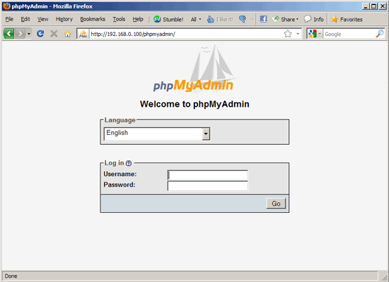

.. EARS milter installation

EARS Milter Installation
########################

.. contents::
   :local:

Server Installation
*******************

This milter has been tested on Debian Squeeze/Wheezy using a LAMP (Linux/Apache/MySQL/PHP)-based web server [#f1]_.

Debian Install
==============

Installing a Debian Squeeze/Wheezy server is a fairly straight-forward procedure.  The best method to use
can be found via HowtoForge's `The Perfect Server - Debian Squeeze (Debian 6.0) [ISPConfig 2]`_ and following
it up through **8 Change The Default Shell** on page 3.


.. note::
   In WRT's environment, virtual linux servers are set up using Linux Containers (`lxc`_). 
   
   To create a new system, log in to the LXC server as root and use the  ```lxc-prepare`` `script`_.
   
   Make sure to edit ``/var/lib/lxc/<machine name>/rootfs/etc/network/interfaces`` and enter the appropriate
   static IP, routing and gateway information.

Web Server Installation
=======================

.. note:: Unless otherwise specifiec, all commands are run as the ``root`` user.

The web server needs to be set up in a LAMP configuration (Apache Web Server, MySQL, PHP)

#. Install MySQL

   .. code-block:: sh

      aptitude install mysql-server mysql-client

   Enter a password for the root MySQL user.

#. Install Apache2

   .. code-block:: sh

      aptitude install apache2

   Test to see that the web-server is running properly by visiting the IP address of this server in a web browser.
   You should see an image similar to this:

   .. image:: images/apache2.png

#. Install PHP5

   PHP5 and the Apache PHP5 module are required to serve the EARS web-based code.  Install them as follows:

   .. code-block:: sh

      aptitude install php5 libapache2-mod-php5

   Restart Apache:

   .. code-block:: sh

     /etc/init.d/apache2 restart

#. Install MySQL support in PHP5

   To get MySQL support in PHP, we can install the *php5-mysql* package. It's a good idea to install some other PHP5 modules as well as you might need them for your applications. You can search for available PHP5 modules like this:

   .. code-block:: sh

      apt-cache search php5

   Pick the ones you need and install them like this:

   .. code-block:: sh

      aptitude install php5-mysql php5-curl php-pear php5-imagick php5-mcrypt php5-memcache

   Now restart Apache2:

   .. code-block:: sh

      /etc/init.d/apache2 restart


Git Installation
================

`Git`_ [#f2]_ is required to download the EARS Milter code from the development repository.

#. Install Git

   .. code-block:: sh

      aptitude install git

#. Configure git access

   * On the EARS Milter server, create a *ssh* key and copy it to the development repository server:

      .. code-block:: sh

         cd ~/.ssh
         ssh-keygen -t rsa
         cd ~

      Hit return at the prompts to create the key without passphrase authentication.

      .. code-block:: sh

         scp ~/.ssh/id_rsa.pub git

   * Log in to the repository server and authorize the key:

      .. code-block:: sh

         ssh root@git
         cd gitolite-admin
         cp id_rsa.pub keydir/root\@<milterservername>.pub
         emacs keydir/root\@<milterservername>.pub

      | Remove the ``@<servername>`` from the second-to-last line of the file and save

      .. warning:: **DO NOT** delete the last line - a blank line is necessary

      .. code-block:: sh

         git commit -a
         git push

   * On the EARS Milter server, test access to the repository server:

      .. code-block:: sh

         cd /tmp
         git clone gitolite@git:gitolite-admin

      If this fails, please verify all the steps in this section


Mail Server Installation
========================

.. todo:: Install Postfix


Python Installation/Configuration
*********************************


The Debian Way
==============

The Python Way
==============

Optional Software Installation
******************************

phpMyAdmin
==========

`phpMyAdmin`_ is a web interface through which you can manage your MySQL databases. It's a good idea to install it:

.. code-block:: sh

   aptitude install phpmyadmin

You will see the following question:

   | ``Web server to reconfigure automatically:`` <-- apache2
   | ``Configure database for phpmyadmin with dbconfig-common?`` <-- No

Afterwards, you can access phpMyAdmin under http://<serverIP>/phpmyadmin/:




Accquiring and configuring the Milter
*************************************

.. :rubric:: Footnotes

.. [#f1] Adapted from HowtoForge's `Installing Apache2 With PHP5 And MySQL Support On Debian Squeeze (LAMP)`_
.. [#f2] `Pro Git`_ by Scott Chacon is available to read online for free.

.. _Postfix before-queue Milter support: http://www.postfix.org/MILTER_README.html
.. _sendmail Milter installation: https://www.milter.org/developers/installation
.. _The Perfect Server - Debian Squeeze (Debian 6.0) [ISPConfig 2]: http://www.howtoforge.com/perfect-server-debian-squeeze-ispconfig-2
.. _Installing Apache2 With PHP5 And MySQL Support On Debian Squeeze (LAMP): http://www.howtoforge.com/installing-apache2-with-php5-and-mysql-support-on-debian-squeeze-lamp
.. _lxc: http://lxc.sourceforge.net/
.. _script: http://www.google.com/url?sa=t&rct=j&q=&esrc=s&source=web&cd=1&ved=0CCAQFjAA&url=http://mindref.blogspot.com/2011/01/debian-lxc-create.html&ei=Gxk-UO7IMIH86wGEoIGgDg&usg=AFQjCNH8nf1DFSRpLmQigOgj8AsU-xhA3Q&sig2=KpSOTudr5eTp97MCE7aLRw
.. _phpMyAdmin:  http://www.phpmyadmin.net
.. _Git: http://git-scm.com
.. _Pro Git: http://git-scm.com/book
